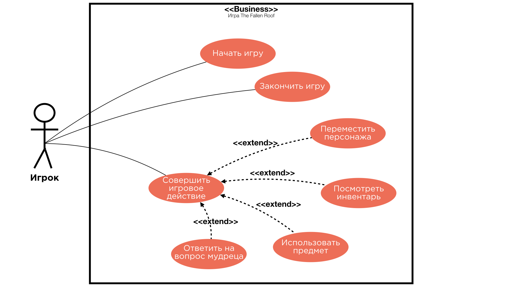
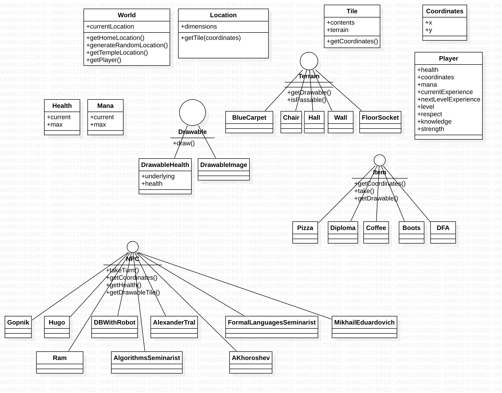
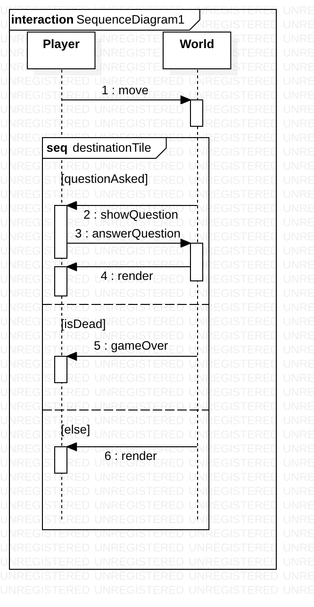

# The Fallen Roof

### Разработчики

Соколов Никита, Кораблинов Владислав, Садовников Александр

## Игровой процесс

Игрок попадает в Мир Знаний, однако сразу же понимает, что находиться ему тут
не очень хочется, так как дома его ждут любимые девушка, работа и видосы на ютубе.
Увы, выбраться из Мира Знаний не так просто, как хотелось бы: для этого Игроку
надо либо уничтожить всех противников, охранающих выход из Мира Знаний, либо
получить Диплом, являющийся подтверждением того, что у Игрока есть достаточное
количество Знаний.

Выход из Мира Знаний находится в отдельной локации, в которую игрок может попасть в любой
момент времени, однако выход охраняется несметными полчищами мобов, так что
добраться до него сможет только прокачанный персонаж.

Накапливать знания, необходимые для получения Диплома, можно, отвечая на вопросы
Мудрецов, обитающих в локации Храм Знаний.

Для того чтобы фармить опыт и крутые итемы, существует отдельная случайно генерируемая
локация-данжен, в которую можно попасть из Храма Знаний.

## NPC

### Враждебные

#### Практик по алгоритмам

Практик по алгоритмам атакует Игрока только в том случае, если уровень знаний игрока
ниже некоторого (случайно сгенерированного) уровня знаний, который практик по алгоритмам
считает приемлемым.

#### Гопник

Гопник атакует Игрока только в том случае, если уровень авторитета игрока
ниже некоторого (случайно сгенерированного) уровня авторитета, который гопник
считает уважаемым. При убийстве гопника Игрок получает авторитет.

#### Барашек

Барашек атакует Игрока в любом случае.

#### Артём Хорошев

Уникальный противник, который может сущестовать в одном единственном экземпляре
во всей локации. Атаки Артёма отнимают у игрока не здоровье, а знания. Кроме
того, Артём умеет ходить сразу на две клетки за один игровой тик, так что
убежать от него будет очень непросто!

### Дружелюбные

#### Практик по формальным языкам

Практик по формальным языкам выдаёт Игроку случайный предмет в том случае,
если уровень знаний игрока выше некоторого (*не* случайно сгенерированного)
уровня знаний. При выдаче предмета Игроку практик по формальным языкам обязательно
говорит "Воть!".

### Отсутствующие

#### Практик по джаве

Такого NPC в нашей игре просто нет.

### Мудрецы

Отдельный подкласс дружелюбных NPC, которые встречаются только в Храме Знаний.
При встрече с Игроком Мудрец задаёт ему вопросы по определённой теме.
Если игрок успешно отвечает на поставленный Мудрецом вопрос, то получает Знания,
если ответ игрока не удовлетворил Мудреца, то на игрока нападают внезапно
появившиеся барашки.

В мире игры существуют следующие Мудрецы:

#### Александр Траль

Александр является признанным знатоком алгоритмов, поэтому мучает игрока
исключительно вопросами по данной тематике. Очень часто отсутствует в Храме
по причине постоянных командировок.

#### Домовой Кузя

Даже домовой в Храме Знаний является Мудрецом! Докучает игроку вопросами
про один из островов Индийского океана.

#### Дима Барашев и Робот

Эти два Мудреца не существуют отдельно друг от друга, поэтому и вопросы 
игроку задают синхронно (то есть по два сразу). Вопросы, кстати, исключительно
на тему трансгуманизма.

#### Михаил Эдуардович

Настолько уверен в том, что Игрок "и так знает" ответы на всего его вопросы,
что выдаёт Знания просто так.

#### TBD

Данный раздел дорабатывается.

## Игровые локации

### Храм знаний

Как уже было сказано, в этой локации обитают Мудрецы. Игрок может
вернуться в данную локацию в любой момент времени (если это позволяет
боевая обстановка), воспользовавшись Камнем Возвращения. 

Кроме того, эта локация является стартовой: в начале 
игры игрок просыпается посреди
Храма Знаний и получаеет Камень Возвращения от Домового Кузи.

В локации нет враждебных NPC до тех пор, пока Игрок не ответит неправильно на
вопрос кого-то из Мудрецов.

В локации также находится кофе-машина, при взаимодействии Игрока с которой
на соседней клетке появляется стакан с кофе.

### Окно домой

Локация, в которой находится выход из Мира Знаний. Локация просто-таки
кишит гопниками и практиками по алгоритмам, поэтому пробраться через
неё к заветному окну и выйти из Мира Знаний сможет не каждый смельчак.

В эту локацию можно попасть из Храма Знаний.

### Случайный лес

Случайно генерируемый данжен, предназначенный для того, чтобы Игрок
мог фармить опыт и находить новые крутые итемы. Попасть в Случайный Лес
можно из Храма Знаний.

## Игрок

### Характеристики

#### Здоровье

Всё очень прозаично: есть шкала здоровья, когда она опускается до нуля,
игра заканчивается.

#### Мана

Требуется для того, чтобы использовать итемы, хранящиеся в инвентаре Игрока.

#### Знания

При накоплении определённого уровня Знаний Игрок получает возможность
получить легендарный предмет — Диплом.

Кроме того, уровень знаний определяет взаимодействие игрока с практиками по
алгоритмам и по формальным языкам.

#### Авторитет

Авторитет влияет на то, нападают на Игрока гопники или нет.

#### Сила

Определяет количество повреждений, которое Игрок наносит враждебным
NPC при столкновении с ними.

### Инвентарь

Все предметы, которые находит Игрок, автоматически экипируются
и попадают к нему в инвентарь. В инвентаре можно посмотреть, какой клавишей
можно использовать тот или иной предмет, к какому эффекту это приведёт
и сколько маны это будет стоить.

Вместимость инвентаря не ограничена.

### Уровень

Уровень игрока определяет, чему равны его базовая сила, здоровье 
и мана.

## Боевая система

Основа боевой системы классическая для 
всех roguelike-игр: если Игрок пытается занять клетку,
на которой находится противник, или противник пытается занять клетку,
на которой находится Игрок, то либо противнику, либо Игроку наносятся
повреждения, соотвествтующие силе того, кто пытается занять клетку.

Кроме того, у игрока в инвентаре могут оказаться итемы, повзоляющие 
наносить урон противникам.

## Игровые механики

### Знания

При накоплении Игроком определённого уровня знаний он может придти в
Храм Знаний и по нажатию специальной клавиши потребовать у Мудрецов
Диплом. После этого Игрок сможет спокойно пройти через локацию
Окно Домой и закончить игру.

Знания добываются посредством ответов на вопросы мудрецов.

### Авторитет

Чем выше авторитет Игрока, тем более вероятно, что очередной встреченный
Игроком гопник не будет на него нападать. Авторитет можно поднимать за
счёт убийства гопников.

### Опыт

Убийство каждого моба и каждый правильный ответ на вопрос Мудреца 
дают Игроку опыт,
необходимый для повышения уровня. При повышении уровня такие характеристики 
Игрока, как здоровье, мана и сила увеличиваются
на фиксированное количество единиц.

## Игровые предметы (итемы)

### Диплом

При экипировке Диплома уровень знаний Игрока и его авторитет становятся равны
бесконечности, что повзоялет ему беспрепятственно пройти через локацию
Окно Домой (никто из гопников и практиков по алгоритмам просто не осмелится
напасть на Игрока).

### Пицца

Восполняет здоровье Игрока. Используется автоматически при подборе,
в инвентарь не попадает.

### Стакан кофе

Восполняет ману Игрока. Используется автоматически при подборе,
в инвентарь не попадает.

### Ботинки Миши Слабодкина

Стали известны благодаря тому, что как-то Артём Хорошев пришёл на пару
в новых ботинках, а Миша пришёл на ту же пару в тех же ботинках.
Экипировка данного итема даёт Игроку увеличение маны.

### Детерминированный конечный автомат

Экипировка данного предмета увеличивает силу Игрока.

### TBD

Данный раздел дорабатывается.

# Use case диаграмма

# Диаграмма классов

# Диаграмма последовательностей

